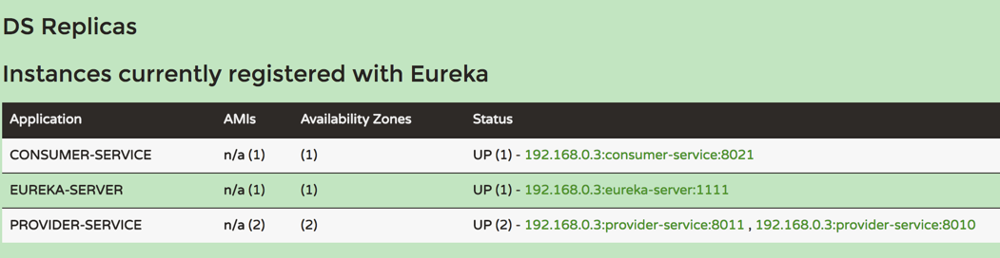

## 服务消费者（rest+ribbon）

---

Spring cloud有两种服务调用方式，一种是ribbon+restTemplate，另一种是feign


### 启动注册中心 eureka-server

```
spring.application.name=eureka-server
server.port=1111


eureka.instance.hostname=r1

eureka.client.register-with-eureka=true


eureka.client.serviceUrl.defaultZone=http://${eureka.instance.hostname}:${server.port}/eureka/

eureka.instance.lease-renewal-interval-in-seconds=5
eureka.instance.lease-expiration-duration-in-seconds=5
```

访问 http://localhost:1111/，查看是否启动成功

### 启动两个服务提供实例 provider-service

application-1.properties

```
spring.application.name=provider-service

server.port=8010
eureka.client.serviceUrl.defaultZone=http://localhost:1111/eureka/


eureka.instance.lease-renewal-interval-in-seconds=5
eureka.instance.lease-expiration-duration-in-seconds=5


```

部署两个实例：

```
java -jar provider-service-1.0.0.jar --spring.profiles.active=1  >/dev/null &
java -jar provider-service-1.0.0.jar --spring.profiles.active=2  >/dev/null &
```

### 启动一个消费实例 consumer-service


application.properties

```
spring.application.name=consumer-service

server.port=8021
eureka.client.serviceUrl.defaultZone=http://localhost:1111/eureka/


eureka.instance.lease-renewal-interval-in-seconds=5
eureka.instance.lease-expiration-duration-in-seconds=5

```



http://localhost:8021/hello?name=Tom，访问该地址，刷新两次

```
每一次返回：
hello，Tom,host:192.168.0.3,service_id:provider-service,port:8010

第二次返回：
hello，Tom,host:192.168.0.3,service_id:provider-service,port:8011
```


RestTemplate几种常见的请求方式:

https://blog.csdn.net/u012702547/article/details/77917939


