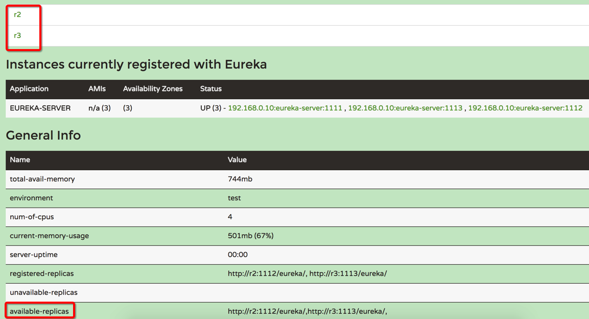

## 网关服务
---

### Eureka-Server  启动注册中心  


application-1.properties

```
spring.application.name=eureka-server
server.port=1111
eureka.instance.hostname=r1
\## 默认是false,此时备份节点会进入unavailable-replicas
eureka.client.register-with-eureka=true
eureka.client.serviceUrl.defaultZone=http://r2:1112/eureka/,http://r3:1113/eureka/

eureka.instance.lease-renewal-interval-in-seconds=5
eureka.instance.lease-expiration-duration-in-seconds=5
```

@EnableEurekaServer注解启动一个服务注册中心提供给其他应用进行对话

```
集群化部署：

java -jar eureka-server-1.0.0.jar --spring.profiles.active=1  >/dev/null &
java -jar eureka-server-1.0.0.jar --spring.profiles.active=2  >/dev/null &
java -jar eureka-server-1.0.0.jar --spring.profiles.active=3  >/dev/null &

```
启动工程后，访问：http://localhost:1111/，可看到注册中心的管理界面




### compute-service 服务提供方 

http://blog.didispace.com/springcloud1/

提供RESTful API，通过 @EnableDiscoveryClient 将服务注册到注册中心

### person-service 服务提供方

内容同上，提供另一维度的业务实现接口


### api-gateway 服务网关


http://blog.didispace.com/springcloud5/

通过服务网关统一向外系统提供REST API的过程中，除了具备服务路由、均衡负载功能之外，它还具备了权限控制等功能。Spring Cloud Netflix中的Zuul就担任了这样的一个角色，为微服务架构提供了前门保护的作用，同时将权限控制这些较重的非业务逻辑内容迁移到服务路由层面，使得服务集群主体能够具备更高的可复用性和可测试性。

```
a） http://localhost:5555/compute/add?a=1&b=2

路由到compute-service工程的，add?a=1&b=2

b）http://localhost:5555/person/get_user_info?name=Tom

路由到person-service工程的get_user_info?name=Tom
```
